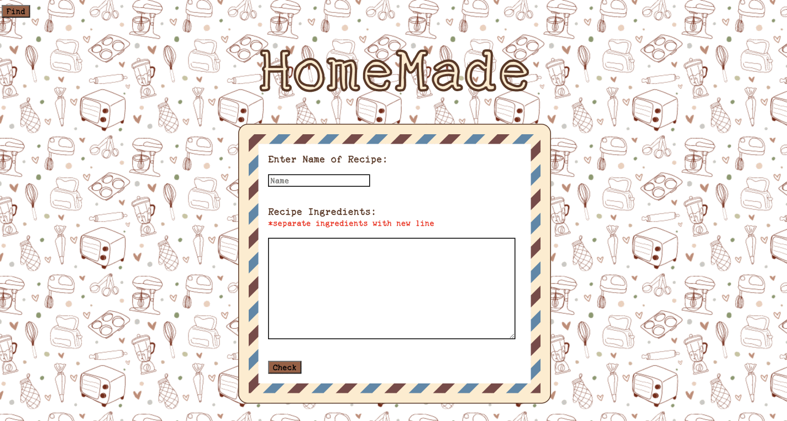

# Secret-Recipes

## Have a recipe ?

Have you tried eating healthier by cooking at home, instead of eating out? Have you ever wondered if your recipe is actually healthy?

Now, with HomeMade you can check to see if your homemade recipe is nutrious and healthy! HomeMade provides real time calculations on the nutritional value of your meal, as well as the ability to save your recipe. Let's give it a try and see what we get.

As you can see below, you can search any creation of yours!

 

 ## What if?

 What if you don't want to constantly look up your recipe to determine calorie intake; or you made something delicious and want to revisit that exact recipe?

 Click the "Find" button and you can search a recipe based on what you titled it earlier! By clicking "Find" you can see the ingredients for the recipe, as well as the calories of the entire meal!
 Check it out below! :

  
